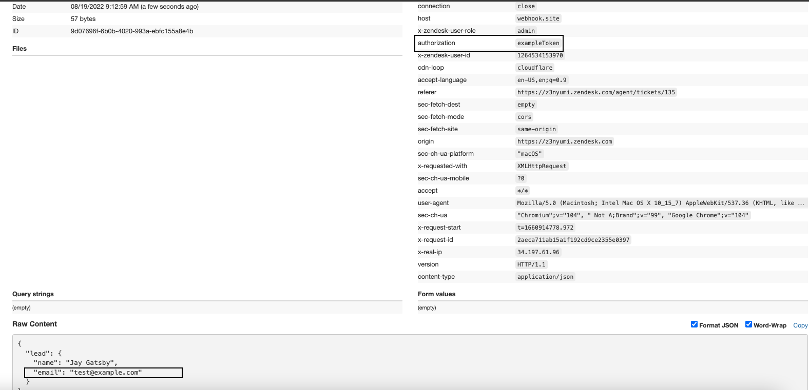

# App name

Secure setting example app. 

## Getting started.
- Before deploying the app. Go to [Webhook.site](https://webhook.site) to spin up an endpoint to receive your request. 
- Grab the unique url and place in the `URL` param of settings object. Keep the endpoint open, you'll need this in a future step.
- Deploy the app, on installation make sure to put values in to the `email` and `token` secure parameters
- Navigate to the app in the ticket sidebar, and kick off a request
- Navigate over to the webhook.site endpoint from the earlier steps. You should see a request that includes your secure parameters.

### Screenshot(s):

